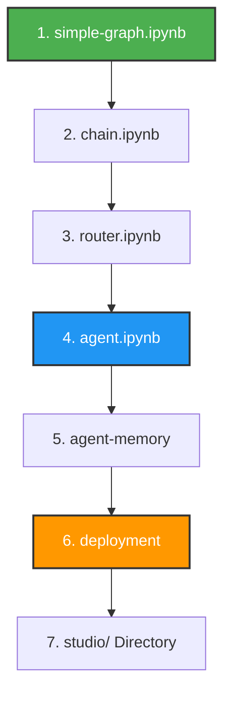

# 🗺️ LangChain & LangGraph Learning Roadmap

Welcome to the project repository! This guide provides the optimal, step-by-step sequence to navigate the files in this directory. 

To maximize your understanding, follow this roadmap sequentially from **basic workflows** to **autonomous agentic systems**, followed by memory management and final deployment.

---

## 🧭 Step-by-Step Learning Path



### 1. `simple-graph.ipynb` 🟢 (Start Here)
* **Focus:** State Machine Fundamentals
* **What it covers:** Building foundational state machines, defining execution nodes (actions), creating edges (transitions), and managing application state.
* **Why refer first:** You must master how data flows through a structured graph before building complex, autonomous behaviors.

### 2. `chain.ipynb`
* **Focus:** Linear Execution Paths
* **What it covers:** Linking Prompts, Large Language Models (LLMs), and Output Parsers sequentially using the LangChain Expression Language (LCEL) pipe (`|`) operator.
* **Why refer second:** This teaches you the core syntax of modern LangChain in its simplest, most deterministic form.

### 3. `router.ipynb`
* **Focus:** Dynamic Execution & Decision Making
* **What it covers:** Conditional routing logic, leveraging an LLM to dynamically select which path or sub-chain to execute based on user input, and fallback handling.
* **Why refer third:** This bridges the gap between rigid, linear chains and autonomous systems by introducing conditional decisions.

### 4. `agent.ipynb` 🔵 (Core Engine)
* **Focus:** Autonomous Goal-Driven Systems
* **What it covers:** Equipping LLMs with functional tools (e.g., search, calculators), implementing the Reason-and-Act (ReAct) loop, and allowing the system to run autonomously until a task is complete.
* **Why refer fourth:** This combines graphs, chains, and routers into a single engine capable of deciding its own next steps.

### 5. `agent-memory.ipynb`
* **Focus:** Stateful Persistence & Conversation Context
* **What it covers:** Implementing short-term and long-term conversational memory, persisting graph states across multiple user turns, and managing conversational threads.
* **Why refer fifth:** An agent is only practical for real-world applications if it can remember past user interactions across sessions.

### 6. `deployment.ipynb` 🟠 (Production)
* **Focus:** Serving Your Application
* **What it covers:** Wrapping your local agents and graphs into production-ready API endpoints (such as LangServe or FastAPI), securing API keys, and handling environment variables.
* **Why refer sixth:** This provides the necessary steps to transition your prototype out of local notebooks and into a live service for web apps or clients.

### 7. `studio/` (Directory)
* **Focus:** Visual Debugging, Tracing & UI Monitoring
* **What it covers:** Configuration files for LangGraph Studio or a custom frontend dashboard to visually monitor, trace, test, and debug live agent states.
* **Why refer last:** Visual debugging tools are significantly easier to leverage once you thoroughly understand the underlying code and state management.

---

## 🚀 Quick Start
To begin your journey, open your terminal and start with the first notebook:
```bash
jupyter notebook simple-graph.ipynb
```
